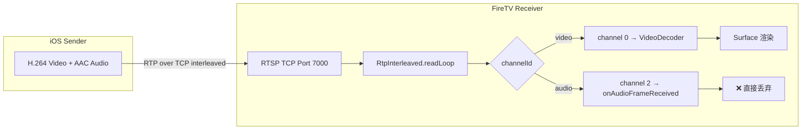
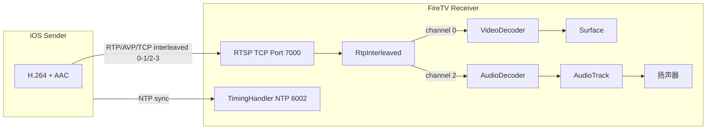
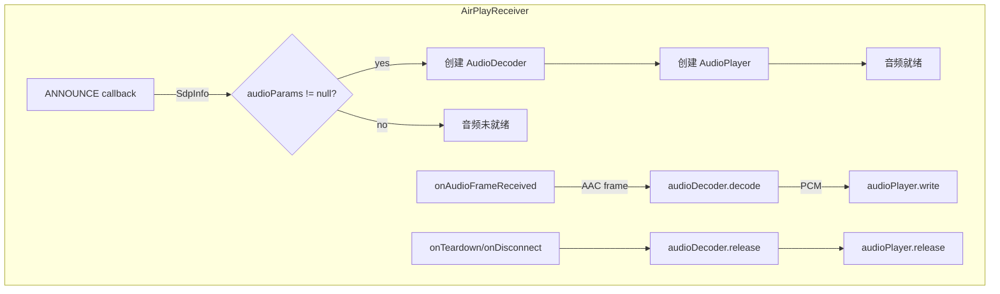

# AirPlay 音频支持实现计划

## 现状分析

当前实现为 **video-only**，音频 RTP 包到达后被 `onAudioFrameReceived()` 空方法直接丢弃。

### 现有音频数据流



### 关键发现
1. `RtpInterleaved.kt` 已正确将 channel 2（audio RTP）路由到 `audioCallback`
2. `AirPlayReceiver.onAudioFrameReceived()` 是**空方法**
3. `RtspSession.handleSetup()` 对 audio 返回 UDP 传输（`RTP/AVP/UDP`），但无 UDP 接收器
4. `SdpParser` 已提取 `m=audio` 参数，但没有暴露给音频解码器使用
5. 没有 `AudioDecoder` 或 `AudioPlayer` 组件

---

## 目标架构（含音频）



---

## 技术方案详解

### 1. 音频传输：统一为 TCP Interleaved

AirPlay 协议中 iOS 设备在 SETUP 后通常会根据响应的 Transport 头来决定使用 TCP 还是 UDP。当前 audio SETUP 返回 UDP，而 video 返回 TCP interleaved。为简化实现，将 audio 也改为 TCP interleaved，使音频和视频共用同一个 TCP 连接。

**修改点**：`RtspSession.kt handleSetup()`

```kotlin
// 修改前：audio 返回 UDP
"Transport" to "RTP/AVP/UDP;unicast;client_port=6001;server_port=6001"

// 修改后：audio 也返回 TCP interleaved
"Transport" to "RTP/AVP/TCP;interleaved=2-3"
```

这样音频和视频都通过同一个 `RtpInterleaved.readLoop` 读取，无需额外 UDP socket。

---

### 2. AAC 音频解码流程

AirPlay 1 音频流的典型参数：
- **编码**：AAC-LC（Low Complexity）
- **采样率**：44100 Hz
- **通道数**：2（立体声）
- **RTP payload type**：通常为 96（动态）
- **RTP clock rate**：44100 Hz（与采样率一致）

#### 2.1 SDP 音频参数提取

从 ANNOUNCE 的 SDP body 中提取：

```
m=audio 0 RTP/AVP 96
a=rtpmap:96 mpeg4-generic/44100/2
a=fmtp:96 mode=AAC-hbr;config=1210;SizeLength=13;IndexLength=3;IndexDeltaLength=3;Profile=1;Rate=44100;Channel=2
```

- `mpeg4-generic` → AAC 封装格式（MPEG-4 Audio Transport Stream）
- `44100` → 采样率
- `2` → 通道数
- `config=1210` → AudioSpecificConfig（hex）→ 解码器 csd-0
- `mode=AAC-hbr` → High Bit Rate mode

**修改点**：`SdpParser.kt` 新增 `AudioParams` 数据类和解析方法

```kotlin
data class AudioParams(
    val sampleRate: Int,        // 44100
    val channelCount: Int,      // 2
    val audioSpecificConfig: ByteArray,  // 从 config=1210 解析
    val profile: Int            // AAC profile (1 = AAC-LC)
)
```

#### 2.2 AAC AudioSpecificConfig 解析

`config=1210`（hex）解码为 2 字节 AudioSpecificConfig：
- Byte 0: `0x12` = `0001 0010`
  - bits 7-4: `0001` = audioObjectType = 1 (AAC-LC)
  - bits 3-0: `0010` = samplingFrequencyIndex = 2 (44100 Hz)
- Byte 1: `0x10` = `0001 0000`
  - bits 7-3: `00010` = channelConfiguration = 2 (stereo)

这 2 字节作为 `MediaFormat.KEY_AAC_PROFILE` 的 csd-0 传入 MediaCodec。

---

### 3. AudioDecoder 实现（MediaCodec AAC 硬解）

仿照 `VideoDecoder` 的设计，创建 `AudioDecoder`：

```kotlin
class AudioDecoder(
    audioParams: AudioParams,
    private val onPcmOutput: (ByteArray, Long) -> Unit  // PCM data + presentation time
) {
    private var codec: MediaCodec? = null
    private val audioFormat: MediaFormat
    
    init {
        audioFormat = MediaFormat.createAudioFormat(
            MediaFormat.MIMETYPE_AUDIO_AAC,
            audioParams.sampleRate,
            audioParams.channelCount
        )
        audioFormat.setByteBuffer("csd-0", 
            ByteBuffer.wrap(audioParams.audioSpecificConfig))
        
        codec = MediaCodec.createDecoderByType(MediaFormat.MIMETYPE_AUDIO_AAC)
        codec?.configure(audioFormat, null, null, 0)
        codec?.start()
    }
    
    fun decode(aacFrame: ByteArray, ptsUs: Long) {
        // 1. dequeueInputBuffer
        // 2. copy AAC frame (去掉 RTP header 后的 payload)
        // 3. queueInputBuffer with ptsUs
        // 4. drainOutput → 获取 PCM 数据
        // 5. onPcmOutput(pcmData, ptsUs)
    }
    
    fun release() { ... }
}
```

**关键技术点**：
- RTP audio payload 需要去除 4 字节的 AU-headers（AAC-hbr mode 的 RTP 封装格式）
- 解码后的 PCM 格式：16-bit signed, 根据 channelCount 可能是 stereo interleaved
- 使用 `MediaCodec` 非阻塞模式（`dequeueOutputBuffer(timeoutUs=0)`）

---

### 4. AudioPlayer 实现（AudioTrack）

```kotlin
class AudioPlayer(
    sampleRate: Int = 44100,
    channelConfig: Int = AudioFormat.CHANNEL_OUT_STEREO,
    encoding: Int = AudioFormat.ENCODING_PCM_16BIT
) {
    private val audioTrack: AudioTrack
    private val bufferSize: Int
    
    init {
        bufferSize = AudioTrack.getMinBufferSize(sampleRate, channelConfig, encoding) * 2
        audioTrack = AudioTrack(
            AudioAttributes.Builder()
                .setUsage(AudioAttributes.USAGE_MEDIA)
                .setContentType(AudioAttributes.CONTENT_TYPE_MUSIC)
                .build(),
            AudioFormat.Builder()
                .setSampleRate(sampleRate)
                .setEncoding(encoding)
                .setChannelMask(channelConfig)
                .build(),
            bufferSize,
            AudioTrack.MODE_STREAM,
            AudioManager.AUDIO_SESSION_ID_GENERATE
        )
        audioTrack.play()
    }
    
    fun write(pcmData: ByteArray) {
        audioTrack.write(pcmData, 0, pcmData.size)
    }
    
    fun stop() { audioTrack.stop() }
    fun release() { audioTrack.release() }
}
```

---

### 5. 集成到 AirPlayReceiver



**修改点**：
1. `AirPlayReceiver` 新增 `audioDecoder: AudioDecoder?` 和 `audioPlayer: AudioPlayer?` 字段
2. `onAnnounce()` 回调中，解析 SDP 后若包含 audio 参数，初始化 `AudioDecoder` + `AudioPlayer`
3. `onAudioFrameReceived()` 中调用 `audioDecoder?.decode(data, ptsUs)`
4. `releaseVideoDecoder()` 扩展为 `releaseDecoders()`，同时释放音频组件

---

### 6. 基础音视频同步（可选但推荐）

AirPlay 使用 NTP timing（端口 6002）来同步发送端和接收端的时钟。当前 `TimingHandler` 已实现 NTP 服务器，但音视频同步尚未利用。

**简化方案**：使用 RTP timestamp 作为基础同步
- Video: `ptsUs = rtpTimestamp * 1_000_000L / 90_000L`（90kHz clock）
- Audio: `ptsUs = rtpTimestamp * 1_000_000L / sampleRate`（44100Hz clock）
- MediaCodec 的 `queueInputBuffer(presentationTimeUs)` 自带基本同步
- AudioTrack 以 stream 模式播放，天然具有较低延迟

**进阶方案**（后续迭代）：基于 NTP 的精确 A/V sync
- 通过 TimingHandler 的 NTP 往返计算网络延迟和时钟偏移
- 维护一个 jitter buffer 来平滑网络抖动
- 根据视频帧率和音频采样率微调播放速度

---

## 修改文件清单

| # | 文件 | 修改类型 | 说明 |
|---|---|---|---|
| 1 | `RtspSession.kt` | 修改 | audio SETUP 返回 TCP interleaved |
| 2 | `SdpParser.kt` | 修改 | 新增 AudioParams 数据类和解析方法 |
| 3 | `RtpInterleaved.kt` | 无修改 | 已正确路由 audio channel 2 |
| 4 | **新增** `AudioDecoder.kt` | 新增 | AAC MediaCodec 硬件解码 |
| 5 | **新增** `AudioPlayer.kt` | 新增 | AudioTrack PCM 播放 |
| 6 | `AirPlayReceiver.kt` | 修改 | 集成音频组件生命周期 |
| 7 | `AirPlayCrypto.kt` | 可能修改 | 如需对音频 payload 解密（AES-CTR） |
| 8 | `proposal.md` | 修改 | 更新文档，移除"视频-only"描述 |
| 9 | `task.md` | 修改 | 补充音频实现任务 |

---

## 实施步骤（按依赖顺序）

### Step 1: RTSP SETUP 修复（Task A）
- 修改 `RtspSession.handleSetup()`：audio 也返回 `RTP/AVP/TCP;interleaved=2-3`
- 确保 video 和 audio SETUP 都完成后才进入 RTP 读取阶段（已满足）

### Step 2: SDP 音频参数解析（Task B）
- 在 `SdpParser.kt` 中新增 `AudioParams` 数据类
- 新增 `getAudioParams(sdpMedia: SdpMedia): AudioParams?` 方法
- 解析 `config=` hex 字符串为 AudioSpecificConfig 字节数组
- 解析 `rtpmap` 中的采样率和通道数

### Step 3: 音频解码器（Task C）
- 创建 `AudioDecoder.kt`
- 使用 `MediaCodec.createDecoderByType(MIMETYPE_AUDIO_AAC)`
- 配置 csd-0（AudioSpecificConfig）
- 实现 `decode(aacFrame: ByteArray, ptsUs: Long)` 方法
- 处理 RTP AU-headers（AAC-hbr mode）
- 输出 PCM 到 callback

### Step 4: 音频播放器（Task D）
- 创建 `AudioPlayer.kt`
- 使用 `AudioTrack` 以 STREAM 模式
- 配置 `AudioAttributes.USAGE_MEDIA`
- 实现 `write(pcmData: ByteArray)` 和生命周期方法

### Step 5: AirPlayReceiver 集成（Task E）
- 在 `AirPlayReceiver` 中新增 `audioDecoder` 和 `audioPlayer` 字段
- `onAnnounce()` 中初始化音频组件
- `onAudioFrameReceived()` 中调用音频解码
- `stop()` / `onClientDisconnected()` 中释放音频组件
- 处理加密音频：若 AES key 存在，先解密再解码

### Step 6: 基础同步（Task F）
- 验证 audio/video 的 RTP timestamp 转换正确
- 观察实际播放时的 A/V 偏移，必要时微调

### Step 7: 文档更新（Task G）
- 更新 `proposal.md`：明确支持音视频
- 更新 `task.md`：补充音频实现子任务

### Step 8: 构建验证（Task H）
- `./gradlew assembleDebug` 编译通过
- `./gradlew lint` 检查无新增警告

---

## 风险与注意事项

1. **AAC-hbr AU-headers**：AAC 的 RTP 封装在 AAC-hbr mode 下每帧有 4 字节的 AU-header（2 bytes AU-headers-length + 2 bytes AU-size + AU-index），`AudioDecoder` 需要正确剥离这些头才能喂给 MediaCodec。

2. **AudioSpecificConfig 解析**：`config=` hex 值的长度可能不同（1-2 字节常见），需要健壮解析。

3. **加密音频**：AirPlay 可能对音频 payload 也进行 AES-CTR 加密。若 `aesKey` 和 `aesIv` 存在，需要在 `onAudioFrameReceived` 中先解密再解码。

4. **MediaCodec 音频延迟**：AAC 解码有固有延迟（priming frames），AudioTrack 也有 buffer 延迟，实际播放可能有 100-300ms 延迟。

5. **UDP vs TCP**：部分 iOS 版本可能坚持用 UDP 传输音频。如果改为 TCP interleaved 后不工作，需要回退方案（同时支持 UDP 接收）。

6. **采样率**：虽然 AirPlay 通常为 44100 Hz，但也可能遇到 48000 Hz。`AudioPlayer` 初始化应使用 SDP 中解析的实际采样率。
